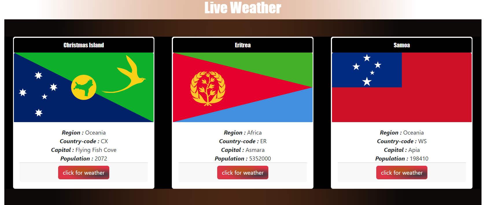

# Restcountries and Weather Using Fetch API

## Here to create all `HTML` element using `DOM`.

## Using `fetch()` API to get both restcountries data and open weather.

## Using `Bootstrap` cards to display the necessary data on the screen.

## Here to display the below value in the Bootstrap cards, `Capital`, `Region`,`Name`,`Latlng`,`Flag` and `Country Code`.

## Here added a images for your reference,

